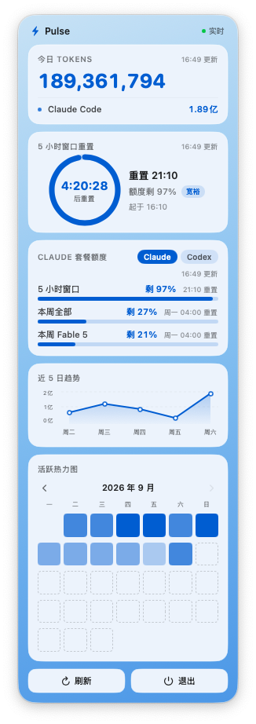

# Pulse

[中文说明](README.zh-CN.md)

A macOS menu bar app that shows your Claude Code and Codex usage at a glance: today's token count, how fast you're burning through your current 5-hour window, and how much of your weekly quota is left. Everything is parsed locally from your own session files, no telemetry, no account required.

<p align="center">
  
  &nbsp;&nbsp;
  
</p>
<p align="center"><sub>English UI · 中文界面</sub></p>

## Features

- **Menu bar glance**: a small ring showing how much quota is left in the current 5-hour window, time until it resets, today's total token count, and your weekly quota remaining, e.g. `◔ 4:47  176M  27%`.
- **Expandable panel** with five cards:
  - **Today's tokens**: total plus a breakdown per tool.
  - **5-hour countdown**: a ring (fill = quota remaining, not time) with the remaining time inside it, plus a pace label (On track / Fast / Too fast).
  - **Plan quota**: 5-hour and weekly progress bars, with a Claude / Codex switcher in the corner (your choice is remembered).
  - **5-day trend** line chart.
  - **Monthly heatmap** calendar of daily activity.
- **100% local token stats** — parses `~/.claude/projects/**/*.jsonl` and `~/.codex/sessions/**/*.jsonl` directly, no network call involved.
- **Quota reuses your existing login** — Claude quota is read using the OAuth token your local Claude Code CLI already has; Codex quota is read from files Codex itself already writes locally. Pulse never asks you to log in separately.
- **Event-driven, not polling** — after an initial one-time scan, an FSEvents watcher picks up new sessions incrementally. CPU usage is 0% while idle.
- **Follows your system language** — Chinese system shows Chinese labels and 亿/万 units; anything else shows English and B/M/K units.
- **Colorblind-safe** — status is never conveyed by red vs. green alone; every state has a text label, and the only accent colors used are blue and orange.
- **Optional: switch between Claude accounts** — if you use more than one Claude account, install the bundled `cswitch` helper and an extra card lists your accounts, each one's last-seen quota and weekly reset time, with a one-click switch. See [Multiple Claude accounts](#multiple-claude-accounts-optional).
- Single-instance (a second launch quits immediately), quit from the "Quit" button at the bottom of the panel.

## Install

### Option A: Download a release

1. Download the latest zip from [Releases](../../releases), unzip it, and drag `Pulse.app` into `/Applications`.
2. Pulse isn't notarized or signed with an Apple Developer certificate, so Gatekeeper will block the first launch ("Pulse.app is damaged" or "cannot be opened"). Fix it with either:
   ```bash
   xattr -dr com.apple.quarantine /Applications/Pulse.app
   ```
   or right-click `Pulse.app` → **Open** → confirm in the dialog.

### Option B: Build from source

Requires macOS 13+ and Xcode Command Line Tools (no full Xcode needed):

```bash
xcode-select --install   # skip if already installed
git clone https://github.com/jedeeai/pulse.git
cd pulse
bash scripts/build-app.sh
open dist/Pulse.app
```

## How it works

Pulse only ever looks at data your CLI tools already generate on disk, and re-uses credentials they've already stored.

| Tool | Tokens source | Quota source |
|---|---|---|
| Claude Code | `~/.claude/projects/**/*.jsonl`, deduplicated by `message.id`. Counted as input + output + cache_creation + cache_read (matches ccusage's Total). | `https://api.anthropic.com/api/oauth/usage` (the same endpoint claude.ai/settings/usage uses), authenticated with the `accessToken` your local Claude Code CLI already stored in the Keychain (`Claude Code-credentials`), or `~/.claude/.credentials.json` as a fallback. |
| Codex | `~/.codex/sessions/**/*.jsonl` `token_count` events. Counted as input + output + reasoning. | The most recent `rate_limits` event Codex itself writes into your local session file after each request — Pulse makes no network call for this. It only appears, and only updates, once you've actually used Codex. |

Only tools you actually have installed and have used will show data.

Scanning is event-driven: Pulse does one full scan on launch (which can take up to a minute or so on very large histories, shown as `…` in the menu bar), then listens for filesystem changes and only re-parses what changed. Claude quota is polled every 5 minutes; the 5-hour window auto-refreshes when it resets.

## Multiple Claude accounts (optional)

If you have more than one Claude account (say, a personal and a work subscription), Pulse can switch Claude Code between them. This is off by default: the card only appears once the `cswitch` helper is installed.

```bash
# from the repo root
mkdir -p ~/.local/bin
cp scripts/cswitch ~/.local/bin/cswitch
chmod +x ~/.local/bin/cswitch
```

Then save each account once:

1. In Claude Code, `/login` with your first account, then run `cswitch save` in Terminal.
2. `/login` with your second account, then run `cswitch save` again.

Reopen the Pulse panel and a **CLAUDE ACCOUNT** card shows up above the plan card. For each account it shows weekly and 5-hour quota left (the account you're not using shows the last value Pulse saw, with the time), when its weekly quota resets, and a **Switch** button. After switching, *new* Claude Code sessions use the new account; sessions that are already open keep the old one.

You can also use it from Terminal: `cswitch` (switch to the next account), `cswitch use you@example.com`, `cswitch status`.

How it works: Claude Code keeps its login in the Keychain item `Claude Code-credentials`. `cswitch` stores a copy of each account's login in separate Keychain items named `cswitch-account`, and on switch swaps the target account's login into `Claude Code-credentials` and updates `oauthAccount` in `~/.claude.json`. Your memory, settings, skills and history in `~/.claude` are shared by all accounts. MCP server logins stored in the same Keychain item are left untouched. Requires `python3` (comes with the Xcode Command Line Tools).

To uninstall, delete `~/.local/bin/cswitch` (the card disappears), and optionally remove the saved logins in Keychain Access by searching for `cswitch-account`.

## Privacy

- **Reads**: your local `~/.claude` and `~/.codex` session files (never modified), and the Claude Code OAuth `accessToken` from your Keychain.
- **Never reads or touches**: your Claude Code `refreshToken` — Pulse itself only ever reads the short-lived `accessToken` and never writes to the Keychain or your credential files.
- **Exception, only if you install `cswitch`**: switching accounts does write to the Keychain and `~/.claude.json`, because that's what switching means. `cswitch` stores each account's full login (including its `refreshToken`) in your local Keychain and never sends it anywhere. Without `cswitch` installed, none of this happens.
- **Sends**: exactly one kind of network request — to Anthropic's own usage endpoint, using your own already-issued token, to read your remaining quota. That's it.
- **Never sends**: source code, prompts, conversation content, file contents, or any analytics/telemetry. Pulse has no backend of its own.
- **Fully offline mode**: switch the plan quota card to Codex and Pulse makes zero network requests, since Codex quota is read from local files only.

## Menu bar & panel

Menu bar example: `◔ 4:47  176M  27%`

- `◔` — a small ring: how much quota is *left* in the current 5-hour session window (a full ring = full quota remaining, an empty ring = about to hit the limit).
- `4:47` — time remaining until that 5-hour window resets.
- `176M` — total tokens used today, across all tools.
- `27%` — your weekly quota remaining.

In the panel, the 5-hour card shows the same ring (fill = quota remaining), but with the *time* remaining written inside it — the two numbers are meant to be compared against each other. Next to it is a pace label:

- **On track** (blue): remaining-quota fraction minus remaining-time fraction is ≥ 0 — you'll comfortably make it to reset.
- **Fast** (orange): that gap is between -20 and 0 — you're burning quota faster than time is passing.
- **Too fast** (bold orange): that gap is below -20 — you're on track to run out before the window resets.

## Accessibility

Pulse is built by and for someone with red-green color blindness, so:

- No status is ever conveyed by red vs. green alone.
- The only accent colors used for state are blue and orange, chosen to stay distinguishable under red-green color blindness.
- Every colored state also has a text label (e.g. "On track" / "Fast" / "Too fast") — color is decoration, not the only signal.

## Customize / Fork

The codebase is small and split by concern:

- `Sources/Pulse/UsageScanner.swift` — parses local session files into token counts.
- `Sources/Pulse/PlanUsage.swift` + `Sources/Pulse/CodexQuota.swift` — quota fetching/adapters for Claude and Codex respectively.
- `Sources/Pulse/PulseApp.swift` — menu bar item and panel UI.
- `Sources/Pulse/AccountSwitch.swift` + `scripts/cswitch` — optional Claude account switching.
- `Sources/Pulse/L10n.swift` — user-facing strings and number formatting.

To add support for another tool, write an adapter that follows the Codex one (a local-file reader, no login flow) or the Claude one (an OAuth-token reuse reader), then wire it into the scanner and the panel's tool switcher.

## Roadmap

- Estimated cost ($) alongside token counts.
- Support for more coding agents.

## License

[MIT](LICENSE)
