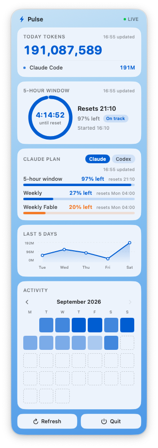

# Pulse

[English](README.md)

Pulse 是一个 macOS 菜单栏 app，一眼看到 Claude Code 和 Codex 的用量：今天用了多少 token，当前这 5 小时的额度还剩多少、烧得快不快，以及本周额度还剩多少。所有数据都是在本机解析你自己的会话文件得出的，不联网上报，也不需要注册账号。

<!-- screenshot: docs/panel.png -->


## 功能

- **菜单栏一眼看**：一个小圆环表示当前 5 小时窗口还剩多少额度，后面跟着距重置的剩余时间、今天用掉的 token 总量、本周额度剩余百分比，形如 `◔ 4:47  176M  27%`。
- **点开的面板有五张卡**：
  - **今日 TOKENS**：总量，加上按工具拆分的明细。
  - **5 小时倒计时**：圆环（圈的填充比例代表额度剩余，不是时间）内写着剩余时间，旁边还有节奏标签（On track 宽裕 / Fast 偏快 / Too fast 超速）。
  - **套餐额度**：5 小时和周额度两条进度条，右上角可以切换 Claude / Codex（选过一次会记住）。
  - **近 5 日趋势**折线图。
  - **月历热力图**，按天展示活跃程度。
- **统计完全本地完成**：直接读 `~/.claude/projects/**/*.jsonl` 和 `~/.codex/sessions/**/*.jsonl`，不涉及任何网络请求。
- **额度复用你已有的登录**：Claude 的额度用你本机 Claude Code CLI 已经登录的 OAuth 令牌去查，Codex 的额度直接读 Codex 自己写在本地的文件。Pulse 不会让你另外登录一次。
- **事件驱动，不是轮询**：启动时做一次全量扫描，之后靠文件系统事件（FSEvents）增量重扫新增内容，空闲时 CPU 占用为 0。
- **界面语言跟随系统**：中文系统显示中文文案和亿/万单位，其他系统显示英文和 B/M/K 单位。
- **色盲友好**：状态从不只靠红绿区分，唯一用到的强调色是蓝色和橙色，并且每个状态都配有文字标签。
- **单实例**：重复打开会直接退出；退出走面板底部的「退出」按钮。

## 安装

### 方式一：下载发布版

1. 从 [Releases](../../releases) 下载最新的 zip，解压后把 `Pulse.app` 拖进「应用程序」文件夹。
2. Pulse 没有做 Apple 开发者签名和公证，所以第一次打开会被 Gatekeeper 拦下（提示「文件已损坏」或「无法打开」）。解决办法二选一：
   ```bash
   xattr -dr com.apple.quarantine /Applications/Pulse.app
   ```
   或者右键点 `Pulse.app` 选「打开」，在弹窗里确认。

### 方式二：从源码构建

需要 macOS 13 及以上系统，以及 Xcode Command Line Tools（不需要装完整 Xcode）：

```bash
xcode-select --install   # 如果已装过可跳过
git clone https://github.com/jedeeai/pulse.git
cd pulse
bash scripts/build-app.sh
open dist/Pulse.app
```

## 数据从哪来

Pulse 只看你的命令行工具本来就会写在磁盘上的数据，也只复用它们已经存好的登录凭证。

| 工具 | Token 数据来源 | 额度数据来源 |
|---|---|---|
| Claude Code | `~/.claude/projects/**/*.jsonl`，按 `message.id` 去重，口径为 input + output + cache_creation + cache_read（与 ccusage 的 Total 一致）。 | `https://api.anthropic.com/api/oauth/usage`（和 claude.ai/settings/usage 页面同一个接口），用你本机 Claude Code CLI 已经存在钥匙串（Keychain）里的 `accessToken` 认证（对应条目名 `Claude Code-credentials`），读不到再退回 `~/.claude/.credentials.json`。 |
| Codex | `~/.codex/sessions/**/*.jsonl` 里的 `token_count` 事件，口径为 input + output + reasoning。 | Codex 每次请求后自己写进本地会话文件里的最新一条 `rate_limits` 事件，Pulse 不为此发起任何网络请求。所以只有你实际用过 Codex 之后才会出现数据，也只在你使用 Codex 时才会更新。 |

只有你实际装了并用过的工具才会显示对应数据。

扫描是事件驱动的：启动时做一次全量扫描（历史记录很大时可能要花一分钟左右，期间菜单栏显示 `…`），之后监听文件变化，只重新解析变动的部分。Claude 额度每 5 分钟拉一次，5 小时窗口到点会自动刷新。

## 隐私

- **会读取**：本机 `~/.claude` 和 `~/.codex` 下的会话文件（只读不改），以及钥匙串里 Claude Code 的 OAuth `accessToken`。
- **绝不读写**：Claude Code 的 `refreshToken`。Pulse 只读那个短期有效的 `accessToken`，不会往钥匙串或你的凭证文件里写任何东西。
- **会发出去的网络请求只有一种**：向 Anthropic 官方的额度接口发请求，用你自己已经拿到的令牌去查你自己的剩余额度，仅此而已。
- **绝不会发出去**：源代码、提示词、对话内容、文件内容，或任何埋点、统计数据。Pulse 没有自己的后端服务器。
- **完全离线模式**：把套餐额度卡切到 Codex，Pulse 就完全不发网络请求了，因为 Codex 的额度是纯读本地文件。

## 菜单栏和面板怎么看

菜单栏示例：`◔ 4:47  176M  27%`

- `◔` 小圆环：当前这 5 小时窗口里额度还剩多少（圆环填满代表额度还很充裕，快空了就是接近上限）。
- `4:47`：距离这个 5 小时窗口重置还有多久。
- `176M`：今天所有工具加起来用掉的 token 总量。
- `27%`：本周额度还剩多少。

面板里的 5 小时卡用的是同一个圆环（填充比例代表额度剩余），只是环里写的是剩余时间，这两个数字放在一起就是为了互相对照。旁边还有一个节奏标签：

- **On track 宽裕**（蓝色）：剩余额度比例减去剩余时间比例大于等于 0，按这个速度能撑到重置。
- **Fast 偏快**（橙色）：这个差值在负 20 到 0 之间，说明额度花得比时间过得快。
- **Too fast 超速**（加粗橙色）：这个差值小于负 20，照这个速度大概率撑不到窗口重置就把额度用完了。

## 无障碍（色盲友好）

Pulse 是给有红绿色盲的人自己用的工具，所以：

- 任何状态都不会只靠红色和绿色来区分。
- 唯一用来表示状态的强调色是蓝色和橙色，这一对在红绿色盲下也能分清。
- 每个有颜色的状态都配了文字标签（比如「On track」「Fast」「Too fast」），颜色只是辅助，不是唯一的信号。

## 二次开发 / Fork

代码量不大，按职责拆开：

- `Sources/Pulse/UsageScanner.swift`：解析本地会话文件，统计 token 数。
- `Sources/Pulse/PlanUsage.swift` 和 `Sources/Pulse/CodexQuota.swift`：分别是 Claude 和 Codex 的额度获取逻辑。
- `Sources/Pulse/PulseApp.swift`：菜单栏图标和面板界面。
- `Sources/Pulse/L10n.swift`：界面文案和数字格式化。

想接入别的工具，照着 Codex 的写法（纯读本地文件，不涉及登录）或者 Claude 的写法（复用已有的 OAuth 令牌）写一个适配器，再接进扫描逻辑和面板的工具切换器就行。

## 后续计划

- 按 token 数估算花费（美元）。
- 支持更多命令行 Agent 工具。

## License

本项目使用 [MIT](LICENSE) 协议开源。
